# Slack App Showcase

A collection of Slack Apps that demonstrate different use cases. These were built to test the [Slack Simulator](https://github.com/ClydeDz/slack-simulator) but can be used as a standalone reference/template as well.

## Apps

- [vote-bot](#vote-bot)
- [jokes-bot](#jokes-bot)
- [gif-bot](#gif-bot)
- [dictionary-bot](#dictionary-bot)
- [acknowledge-bot](#acknowledge-bot)
- [save-bot](#save-bot)
- [form-bot](#form-bot)
- [http-bot](#http-bot)
- [demo-bot](#demo-bot)
- [webapi-bot](#webapi-bot)

### vote-bot

Use the slash command `/vote ["question"] ["option1"] ["option2"]` to trigger voting. Users can click the buttons to cast one vote per question. Clicking on close poll button to see results. Demonstrates the capability of slash commands and block kit elements.

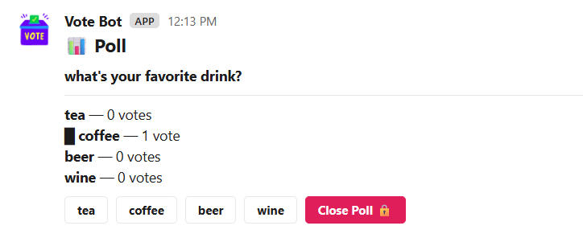
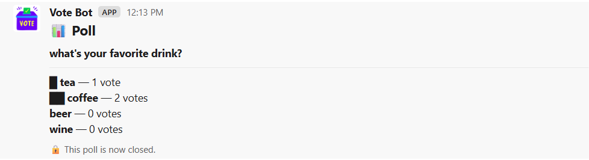

### jokes-bot

Use the slash command `/joke` to get a Chuck Norris joke. Demonstrates the capability of slash commands and updating a message alraedy sent earlier by the bot. Also demonstrates fetching an API for the response.

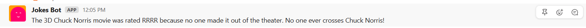

### gif-bot

Share a GIPHY link to get a custom preview of the GIF shared. Demonstrates the capability of link unfurling.

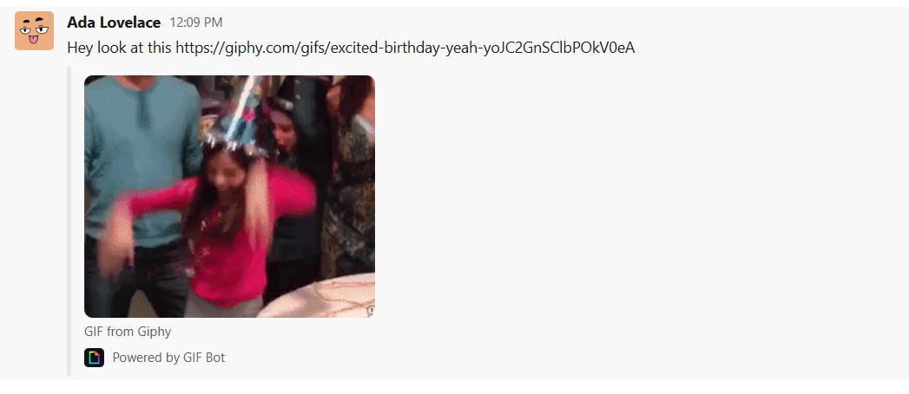

### dictionary-bot

Tag `@dictionary` and ask about the meaning of a word in natural language. Gemini LLM responds with an answer. You'd need to supply your Gemini API key in the `.env` file. Refer to the `.env.example` file for example. Demonstrates the capability of app_mention events, updating the message already sent by the bot, and the use of an LLM to interpret a message and produce a response.

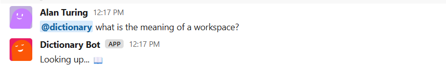
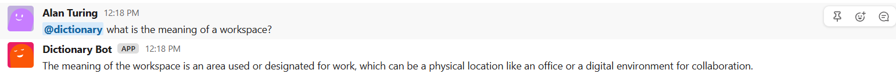

### acknowledge-bot

Posts a welcome message when a new member joins a channel, posts a message when a new channel is created or unarchived, and sends a DM to the person who archived a channel when it happens. Demonstrates the capability of listening to and responding to a variety of events including `member_joined_channel`, `channel_created`, `channel_archive`, and `channel_unarchive` by either directly posting in the channel or via a DM to the person who triggered the event.

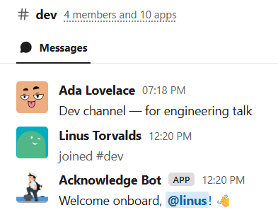
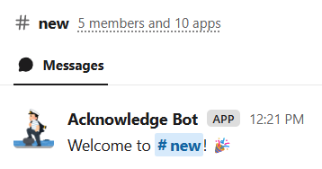
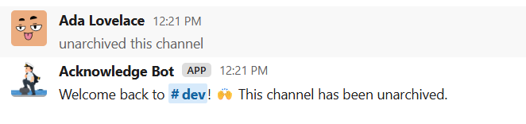
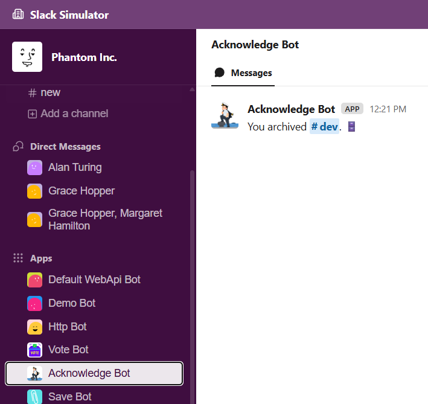

### save-bot

When a user reacts to a message when 👀 (eyes) or pins a message, the save bot will DM the user this same message. Demonstrates the capability of listening to and responding to a variety of events including `reaction_added` and `pin_added`, and also sending a DM to the user.

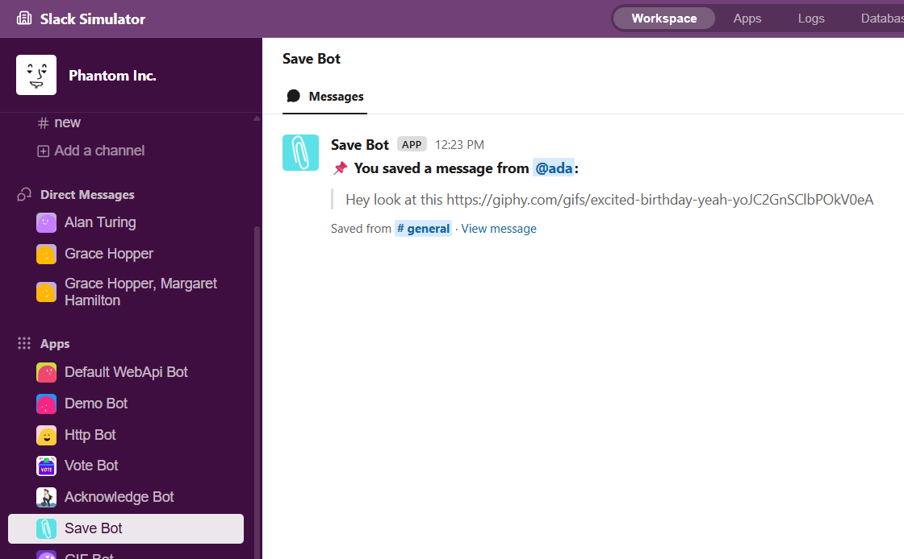
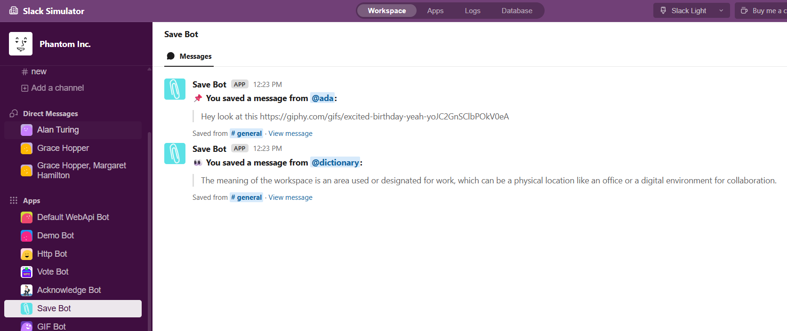

### form-bot

Use the slash command `/form` to trigger a prebuilt two-page form. Upon submitting the form, it will send the submitter a DM with their responses for their record. Demonstrates the capability of a slash command, block kit elements to create the form, using `views.push` to demonstrate multi-step form, using `views.update` to demonstrate conditional form elements, form validation, and sending a DM to the user with the responses.

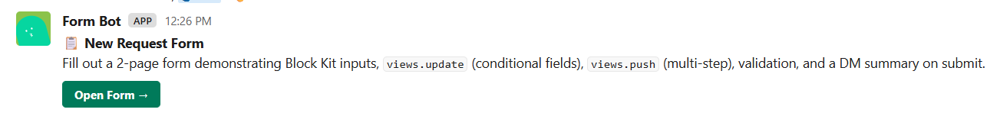
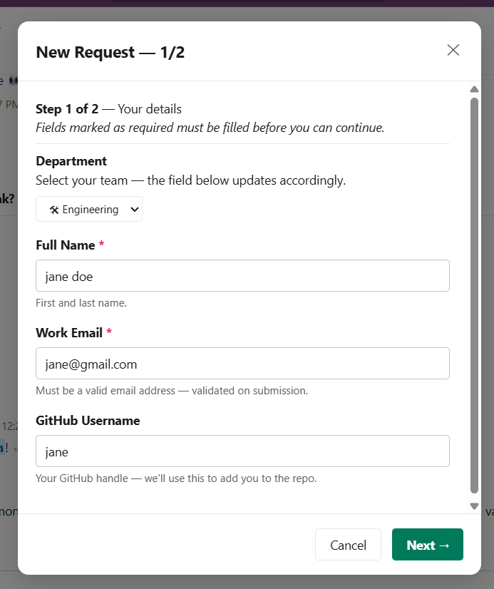
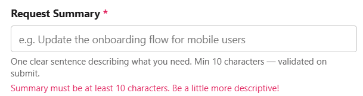
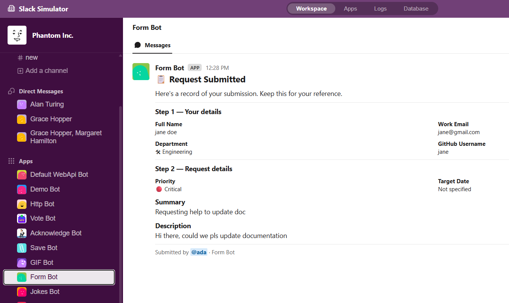

### http-bot

Responds to a 'hello' with a reply in channel, and responds to 'app_mention' events. Demonstrates simple capabilities like responding to keywords and app mentions but via HTTP instead of socket mode.

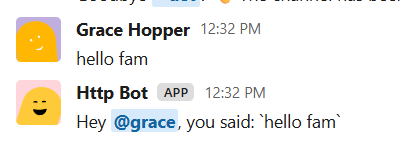
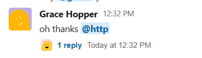
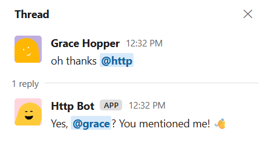

### demo-bot

Responds to a 'hello' with a reply in channel, responds to a 'ping' with a reply in thread, and responds to a 'ghost' message with an ephemeral reply in channel visible only to the sender. Send '/echo hey' to echo your message back to the channel. Also responds to 'app_mention' events. Demonstrates simple capabilities like responding to keywords and app mentions via socket mode.

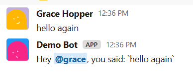
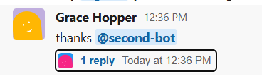
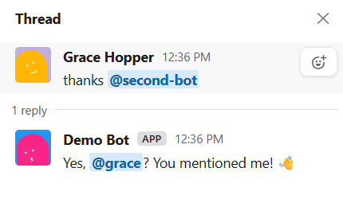
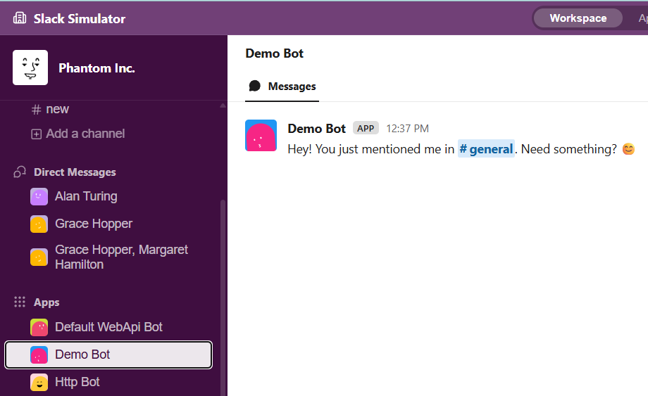
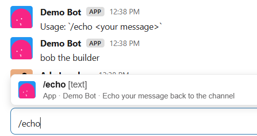
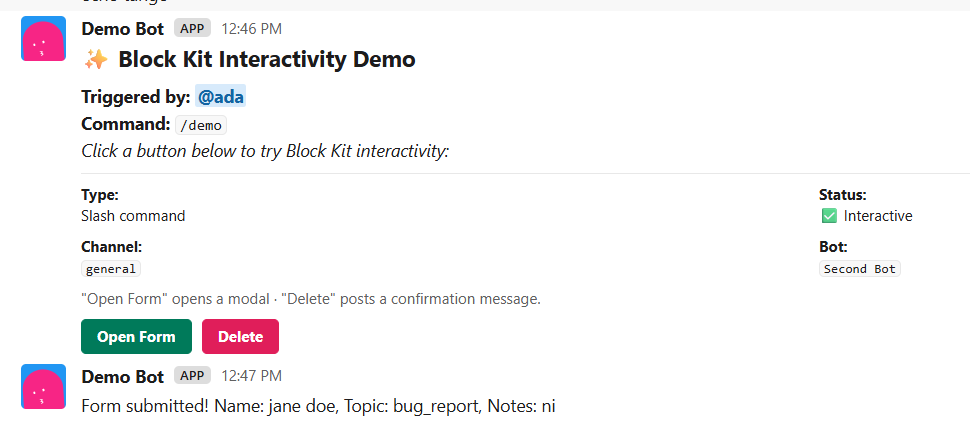

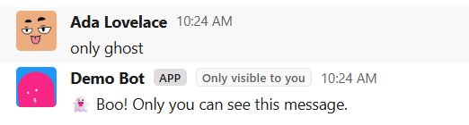

### webapi-bot

Demonstrates capabilities like posting a message via `@slack/web-api` (instead os Bolt SDK) when the app is installed. In the simulator, this bot is also configured to demonstrate posting a message in channels via incoming webhook (i.e. via cURL or Postman).

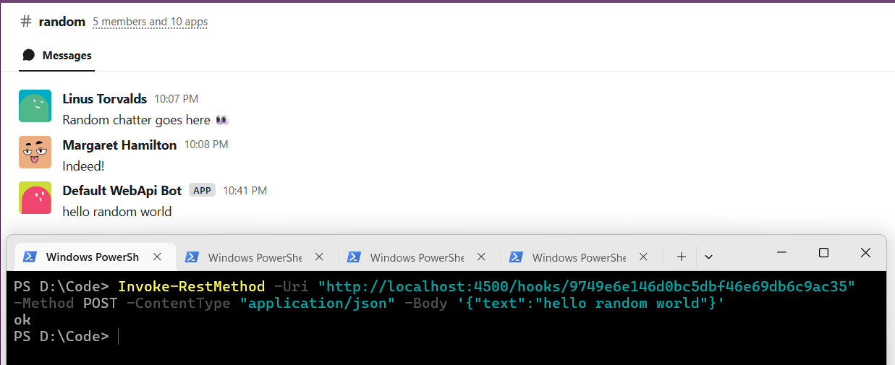

## Credits

Developed by [Clyde D'Souza](https://clydedsouza.net)
